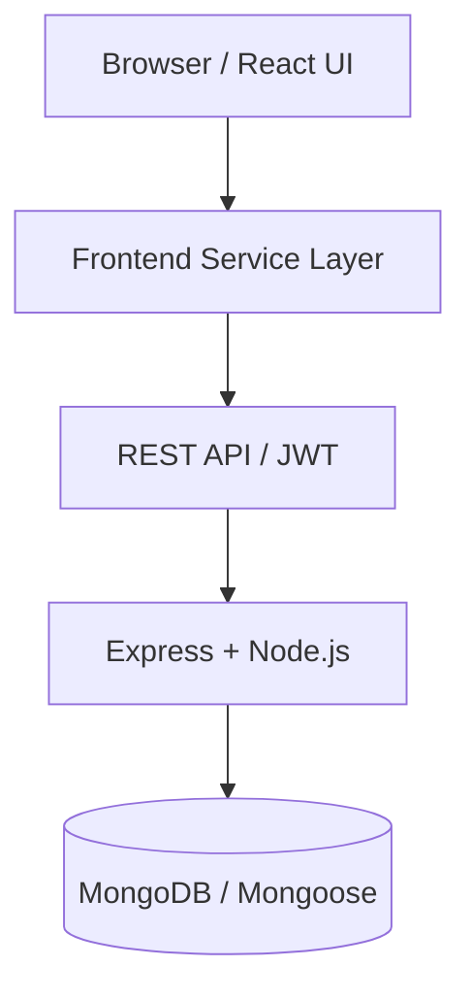
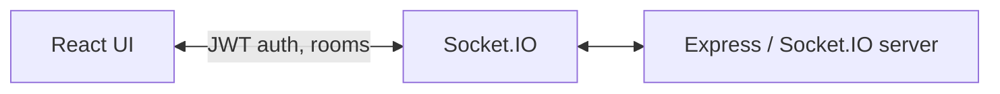

# GURUNANAK Transportation & Logistics

### Moving Every Delivery Forward

> A modular full-stack transportation and logistics management system developed as a research case study to evaluate scalability, modularity, maintainability, security, real-time communication, automated testing, containerization, and cloud architecture trade-offs.

**Repository:** [github.com/balvindersingh07/GURUNANAK-Logistics](https://github.com/balvindersingh07/GURUNANAK-Logistics)

| Area | Status |
|------|--------|
| MERN Architecture | Implemented |
| JWT + RBAC | Implemented |
| REST API | Implemented |
| Socket.IO | Implemented |
| MongoDB | Implemented |
| Docker | Implemented |
| GitHub Actions CI | Implemented |
| Automated Testing | Verified (see [Testing](#testing--quality)) |
| Local k6 Evaluation | Verified (light local workload) |
| Production Cloud Deployment | Not verified |
| Real GPS / Telematics | Simulated |

---

## Overview

**GURUNANAK Transportation & Logistics** is a full-stack transportation and logistics management platform covering delivery operations, fleet and workforce administration, customer-linked shipments, route planning, reporting, notifications, proof-of-delivery capture, and live map-oriented tracking.

The project was developed as a **research case study** addressing:

> *How can modern full stack architectures ensure scalability, modularity, and maintainability?*

The implementation is **CODE FROZEN** for the research submission. Research documentation lives under [`docs/research/`](docs/research/).

---

## Technology Stack

Versions below reflect resolved dependencies in `package-lock.json` / `server/package-lock.json` unless noted as external tooling.

### Frontend

| Technology | Version |
|------------|---------|
| React | 19.2.8 |
| React DOM | 19.2.8 |
| Vite | 8.2.2 |
| TypeScript | 6.0.3 |
| Tailwind CSS | 4.3.3 |
| React Router | 7.18.3 |
| Lucide React | 1.40.0 |
| Recharts | 3.10.1 |
| Leaflet | 1.9.4 |
| React Leaflet | 5.0.0 |
| OpenStreetMap | Map tiles via Leaflet |
| State | React Context API |
| Code splitting | `React.lazy` route-level splitting |
| HTTP client | Native Fetch API |

### Backend

| Technology | Version |
|------------|---------|
| Node.js | 20 (Docker / CI) |
| Express | 4.22.2 |
| MongoDB | External database |
| Mongoose | 8.24.4 |
| JWT (`jsonwebtoken`) | 9.0.3 |
| bcryptjs | 3.0.3 |
| Zod (server validation) | 3.25.76 |
| Socket.IO (server) | 4.8.3 |
| Socket.IO client | 4.8.3 |
| express-rate-limit | 8.7.0 |
| CORS | 2.8.5 |
| dotenv | 16.4.7 |

### Testing & DevOps

| Technology | Notes |
|------------|-------|
| Jest | 30.5.1 |
| Supertest | 7.2.2 |
| Playwright | 1.62.1 (archived QA run in `qa-playwright/results.json`) |
| k6 | 2.2.0 (external install; see [Load testing](#load-testing-k6)) |
| Docker | Multi-stage build, Node 20 Alpine |
| GitHub Actions | CI workflow in `.github/workflows/ci.yml` |
| Oxlint | 1.79.0 |

---

## Core Features

- Authentication and JWT-based authorization
- Role-based access control (Admin, Dispatcher, Driver, Customer)
- Admin, dispatcher, driver, and customer dashboards
- Delivery management with paginated list APIs and filtering
- Fleet, driver, customer, and route management
- Strict delivery status workflow
- Proof of Delivery (photo + signature)
- Notifications and reporting/analytics summary
- Real-time Socket.IO updates
- **Simulated GPS tracking** (not real telematics)
- Offline/demo fallback via `AppContext` + `localStorage`
- Zod request validation and ownership/access-control checks
- API and authentication rate limiting
- Docker containerization
- Automated backend and E2E testing
- GitHub Actions CI
- Local authenticated k6 performance evaluation

---

## User Roles

| Role | Capabilities |
|------|--------------|
| **Admin** | Manage deliveries, drivers, vehicles, customers, routes; view reports and notifications; access settings |
| **Dispatcher** | Manage and assign deliveries; manage routes; monitor operations; view reports (no full admin fleet/settings CRUD by design) |
| **Driver** | View assigned deliveries; update delivery status; complete Proof of Delivery; participate in simulated live tracking |
| **Customer** | View own delivery information; track delivery status; view relevant notifications |

---

## Delivery Workflow

Valid primary progression:

```text
pending
   ↓
assigned
   ↓
picked_up
   ↓
in_transit
   ↓
out_for_delivery
   ↓
delivered
```

Cancellation (`cancelled`) is supported before terminal completion according to validated transition rules on the backend and frontend.

**Proof of Delivery (POD)** is required before a driver can mark a delivery as **delivered**. POD supports:

- Photo
- Signature

---

## Architecture

The application is implemented as a **modular monolith** (not an independently deployed microservices mesh). The API layer is **stateless** using JWT authentication validated per request. **Socket.IO** provides authenticated real-time communication. **GPS data is SIMULATED** via a server-side tracking simulator and is **not** connected to real telematics hardware or a third-party telematics provider.

### Full-stack request flow



### Real-time communication



### Offline / demo fallback

When `/api/health` does not report a healthy MongoDB-backed API, the frontend can operate in **demo mode**:

```text
React UI
   ↓
AppContext
   ↓
localStorage / demo data
```

| Mode | Trigger | Auth | Data |
|------|---------|------|------|
| **Full-stack** | `GET /api/health` → `status: ok` and `mongo: true` | JWT in `gnk_token` | MongoDB via REST |
| **Demo / offline** | API health check fails or network error | Demo users in localStorage | `gnk_app_data` in localStorage |

---

## Security

Verified security mechanisms include:

- JWT authentication on protected REST routes and Socket.IO connections
- bcrypt password hashing (`bcryptjs`); passwords are not returned by the API
- Role-based access control on backend middleware and frontend route guards
- Zod request validation at API boundaries
- Separate rate limiters for authentication and general API traffic  
  (production defaults: **100 auth requests / 15 min**, **300 API requests / min**)
- Configurable CORS via `CORS_ORIGIN`
- Ownership and access checks for deliveries (`assertDeliveryAccess`, role-aware query filters)
- Socket.IO JWT handshake authentication and room authorization before `track:subscribe`
- Password reset tokens hashed with **SHA-256** before storage
- Password reset token expiry (**1 hour**)
- Generic forgot-password response (does not expose whether an email exists in production-style responses)
- Unauthorized API responses (`401`) clear invalid JWT state in the frontend API client

This project **does not** claim formal security certification, penetration-test clearance, or production-grade hardening.

---

## REST API

Base URL (local development): `http://localhost:5000/api`

### Authentication

| Method | Endpoint | Description |
|--------|----------|-------------|
| POST | `/api/auth/register` | Register user |
| POST | `/api/auth/login` | Login → JWT |
| GET | `/api/auth/me` | Current user (JWT) |
| POST | `/api/auth/forgot-password` | Request password reset |
| POST | `/api/auth/reset-password` | Reset password with token |

### Deliveries

| Method | Endpoint | Description |
|--------|----------|-------------|
| GET | `/api/deliveries` | Paginated list (`page`, `limit`, filters) |
| GET | `/api/deliveries/:id` | Get delivery |
| POST | `/api/deliveries` | Create delivery |
| PUT | `/api/deliveries/:id` | Update delivery |
| PATCH | `/api/deliveries/:id/status` | Update status (validated transitions) |
| DELETE | `/api/deliveries/:id` | Delete delivery |
| POST | `/api/deliveries/:id/proof` | Submit Proof of Delivery |
| GET | `/api/deliveries/:id/proof` | Get proof for delivery |
| GET | `/api/deliveries/proofs` | List proofs |

### Drivers

| Method | Endpoint |
|--------|----------|
| GET | `/api/drivers` |
| POST | `/api/drivers` |
| PUT | `/api/drivers/:id` |
| DELETE | `/api/drivers/:id` |

### Vehicles

| Method | Endpoint |
|--------|----------|
| GET | `/api/vehicles` |
| POST | `/api/vehicles` |
| PUT | `/api/vehicles/:id` |
| DELETE | `/api/vehicles/:id` |

### Customers

| Method | Endpoint |
|--------|----------|
| GET | `/api/customers` |
| POST | `/api/customers` |
| PUT | `/api/customers/:id` |
| DELETE | `/api/customers/:id` |

### Routes

| Method | Endpoint |
|--------|----------|
| GET | `/api/routes` |
| POST | `/api/routes` |
| PUT | `/api/routes/:id` |
| DELETE | `/api/routes/:id` |

### Notifications

| Method | Endpoint | Description |
|--------|----------|-------------|
| GET | `/api/notifications` | List notifications |
| PATCH | `/api/notifications/read-all` | Mark all read |
| PATCH | `/api/notifications/:id/read` | Mark one read |
| DELETE | `/api/notifications/:id` | Delete notification |

### Reports & health

| Method | Endpoint | Description |
|--------|----------|-------------|
| GET | `/api/reports/summary` | Aggregation summary |
| GET | `/api/health` | Service + MongoDB connectivity status |

---

## Real-Time Socket.IO

### Server → client events (verified)

| Event | Purpose |
|-------|---------|
| `delivery:updated` | Delivery record updated |
| `delivery:statusChanged` | Delivery status changed |
| `driver:locationUpdated` | Simulated driver location |
| `vehicle:locationUpdated` | Simulated vehicle location |
| `notification:new` | New notification |

### Client → server

| Event | Purpose |
|-------|---------|
| `track:subscribe` | Join authorized delivery tracking room |

### Behaviour

- Socket.IO connections authenticate with **JWT** in the handshake.
- Delivery tracking rooms are authorized before joining (`assertDeliveryAccess`).
- GPS movement is **simulated** by `trackingSimulator.js` through a replaceable `gpsAdapter.js` hook.
- The simulator emits location updates on a **30-second interval** for active deliveries.

---

## Database

The application uses **MongoDB** with **Mongoose**.

### Verified models

- `User`
- `Customer`
- `Driver`
- `Vehicle`
- `Delivery`
- `Route`
- `Notification`
- `ProofOfDelivery`

### Data access patterns

- Relevant **indexes** are defined on frequently queried fields (status, foreign keys, dates, email, etc.).
- List endpoints support **pagination** via `page` and `limit`.
- Default page size: **20**; maximum page size: **100**.
- Delivery listing supports filtering by **status**, **driverId**, **customerId**, and **search** where implemented, with role-aware scoping for customers and drivers.

Connection is configured through `MONGODB_URI` (local MongoDB or Atlas-compatible URI).

---

## Testing & Quality

### Backend integration tests (Jest + Supertest)

| Result | Evidence |
|--------|----------|
| **51 / 51 passed** | Four suites: `auth`, `deliveries`, `rbac`, `security` |

```bash
npm run test:server
# or
cd server && npm test
```

### End-to-end tests (Playwright)

Archived full regression result in `qa-playwright/results.json`:

| Outcome | Count |
|---------|-------|
| Passed | **105** |
| Failed | **2** |
| Blocked | **2** |
| Total | **109** |

This is **not** 100% E2E success. The archived QA honestly records remaining failures and blocked checks (including security-route edge cases and a blocked full POD flow). These outcomes are documented in the research **Results** and **Limitations** sections.

```bash
cd qa-playwright
npm install
node run-qa.mjs
```

See [`qa-playwright/README.md`](qa-playwright/README.md) for the recommended QA sequence and rate-limit notes.

### Load testing (k6)

**Verified authenticated local run** (`performance/load-test.js`):

| Metric | Value |
|--------|-------|
| Virtual users | 5 |
| Duration | 30 seconds |
| Iterations | 75 |
| HTTP requests | 225 |
| Checks | 300 / 300 passed |
| HTTP request failure rate | 0.00% |
| Average response time | 16.3 ms |
| p90 | 30.22 ms |
| p95 | 53.71 ms |
| Throughput | 7.28 requests/sec |
| Threshold | Passed |
| Exit code | 0 |

Endpoints exercised per iteration:

- `GET /api/health`
- `GET /api/deliveries?page=1&limit=20`
- `GET /api/reports/summary`

This is a **local authenticated performance evaluation** under the configured **5 VU / 30 second** workload.

**Do not interpret as:**

- production performance
- maximum system capacity
- cloud-hosted benchmark
- horizontal scaling benchmark
- guaranteed SLA

```bash
# Requires k6 installed separately (e.g. k6 v2.2.0)
BASE_URL=http://localhost:5000 AUTH_TOKEN=<jwt> k6 run performance/load-test.js
```

---

## CI/CD

### GitHub Actions CI (verified)

Workflow: [`.github/workflows/ci.yml`](.github/workflows/ci.yml)

| Job | Steps |
|-----|-------|
| **frontend** | `npm ci`, `npm run lint`, `npm run build` |
| **backend** | `npm ci`, `npm test` (MongoDB 7 service) |
| **docker** | `docker build -t gurunanak-logistics:ci .` |

### Docker

- Multi-stage build
- **Node 20 Alpine** base images
- Serves Vite build output from the Express container
- `HEALTHCHECK` on `GET /api/health`

```bash
docker build -t gurunanak-logistics .
docker run -p 5000:5000 \
  -e JWT_SECRET=your-secret \
  -e MONGODB_URI=mongodb://host.docker.internal:27017/gnk \
  gurunanak-logistics
```

**Automatic production deployment / CD is not verified** in this repository. CI validates build and test quality; it does not deploy to a public cloud environment.

---

## Cloud Readiness & Deployment Strategy

The application is **containerized** and **architecturally designed** for deployment patterns such as:

- Static frontend hosting (e.g. Vercel, AWS S3 + CloudFront)
- Container backend hosting (e.g. Render, AWS/Azure container services)
- Managed MongoDB (e.g. MongoDB Atlas via `MONGODB_URI`)

**Important — current evidence boundaries:**

- A **verified production cloud deployment is not part of the current evidence**.
- **No production deployment URL is claimed**.
- **No automatic production CD pipeline is claimed**.
- MongoDB Atlas **compatibility/readiness** exists through connection-string configuration, but **production Atlas deployment is not verified here**.

Qualitative cloud cost trade-offs evaluated in the research include:

- Vercel vs AWS S3 + CloudFront (frontend)
- Render vs AWS/Azure container hosting (backend)
- MongoDB Atlas vs self-hosted MongoDB
- Serverless vs containerized deployment for this Express + Socket.IO monolith

These analyses are **qualitative architectural/cost trade-offs**, not measured production billing results. See [`docs/research/cloud-cost-trade-offs.md`](docs/research/cloud-cost-trade-offs.md).

---

## Limitations

- **GPS tracking is simulated**, not connected to real telematics.
- **No verified production cloud deployment**.
- **No automatic production CD**.
- **No maximum-capacity benchmark**.
- **No horizontal-scaling benchmark**.
- **k6 evaluation is local** and limited to the configured 5 VU / 30 s workload.
- **Playwright archive:** 105 passed, 2 failed, 2 blocked (109 total) — not 100%.
- **Offline/demo mode** uses `localStorage` and does not replicate server-side multi-user consistency.
- Some **support/settings** functionality remains client-side/local.
- **Password-reset email delivery** is not presented as a fully verified production email integration (`EMAIL_PROVIDER` optional).
- **Proof photos** may use data URLs rather than a production object-storage service such as Cloudinary.
- **No real cloud billing optimization claim** is made.
- Security controls are implemented and tested in development; the system is **not claimed to be production-certified**.

---

## Project Structure

```text
.
├── src/                          # React frontend (Vite + TypeScript)
├── server/                       # Express API, models, middleware, tests
├── performance/                  # k6 load test script
├── qa-playwright/                # Playwright E2E QA scripts and results
├── docs/
│   └── research/                 # Research paper and supporting sections
├── .github/
│   └── workflows/
│       └── ci.yml                # GitHub Actions CI
├── public/                       # Static assets
├── Dockerfile                    # Multi-stage container build
├── package.json                  # Frontend scripts and dependencies
├── .env.example                  # Frontend/root env variable names
└── README.md
```

---

## Local Development

### 1. Clone repository

```bash
git clone https://github.com/balvindersingh07/GURUNANAK-Logistics.git
cd GURUNANAK-Logistics
```

### 2. Install dependencies

```bash
npm install
cd server && npm install && cd ..
```

### 3. Configure environment variables

**Root / frontend** (copy from [`.env.example`](.env.example)):

```env
VITE_API_URL=http://localhost:5000/api
VITE_SOCKET_URL=http://localhost:5000
```

**Backend** (copy from [`server/.env.example`](server/.env.example)):

```env
JWT_SECRET=
MONGODB_URI=mongodb://localhost:27017/gurunanak-logistics
PORT=5000
NODE_ENV=development
CORS_ORIGIN=http://localhost:5173
EMAIL_PROVIDER=
CLOUDINARY_URL=
# Optional overrides:
# RATE_LIMIT_API_MAX=5000
# RATE_LIMIT_AUTH_MAX=1000
```

Optional testing / load-test variables from root `.env.example`:

```env
SKIP_DB_TESTS=0
BASE_URL=http://localhost:5000
AUTH_TOKEN=
```

### 4. Start backend

Requires MongoDB running locally (or a reachable `MONGODB_URI`).

```bash
cd server
npm run dev
```

### 5. Start frontend

```bash
npm run dev
```

Open `http://localhost:5173`

### 6. Run tests

```bash
# Backend (51 Jest tests)
npm run test:server

# Frontend lint + build
npm run lint
npm run build

# Playwright E2E (see qa-playwright/README.md)
cd qa-playwright && npm install && node run-qa.mjs
```

### 7. Run Docker

```bash
docker build -t gurunanak-logistics .
docker run -p 5000:5000 \
  -e JWT_SECRET=your-secret \
  -e MONGODB_URI=mongodb://host.docker.internal:27017/gnk \
  gurunanak-logistics
```

---

## Demo Mode

The application supports a **demo/offline fallback** so core UI workflows can be demonstrated without a running backend or MongoDB. When the API health check fails, the frontend uses `AppContext` and `localStorage` (`gnk_app_data`, demo auth storage) while preserving the same UI structure.

### Demo credentials (full-stack or demo login UI)

| Role | Email | Password |
|------|-------|----------|
| Admin | admin@gurunanak.com | admin123 |
| Dispatcher | dispatcher@gurunanak.com | dispatch123 |
| Driver | driver@gurunanak.com | driver123 |
| Customer | customer@gurunanak.com | customer123 |

You can also use **Continue as Demo User** on the login page. Demo passwords are for demonstration only.

---

## Research Documentation

| Document | Path |
|----------|------|
| Complete research paper | [`docs/research/GURUNANAK-Transportation-Logistics-Research-Paper.md`](docs/research/GURUNANAK-Transportation-Logistics-Research-Paper.md) |
| Literature review | [`docs/research/literature-review.md`](docs/research/literature-review.md) |
| Methodology | [`docs/research/methodology.md`](docs/research/methodology.md) |
| Results | [`docs/research/results.md`](docs/research/results.md) |
| Discussion | [`docs/research/discussion.md`](docs/research/discussion.md) |
| Cloud cost trade-offs | [`docs/research/cloud-cost-trade-offs.md`](docs/research/cloud-cost-trade-offs.md) |

---

## Academic Context

This repository accompanies a research case study on modern full-stack architecture in the **Transportation & Logistics** domain.

**Research question:**

> *How can modern full stack architectures ensure scalability, modularity, and maintainability?*

The project evaluates layered architecture, modular monolith structure, JWT/RBAC security, REST and Socket.IO integration, automated testing, Docker/CI practices, local k6 measurement, and qualitative cloud deployment trade-offs—while explicitly distinguishing **implemented features**, **measured results**, and **unevaluated production claims**.

---

## License

Proprietary — GURUNANAK Transportation & Logistics
